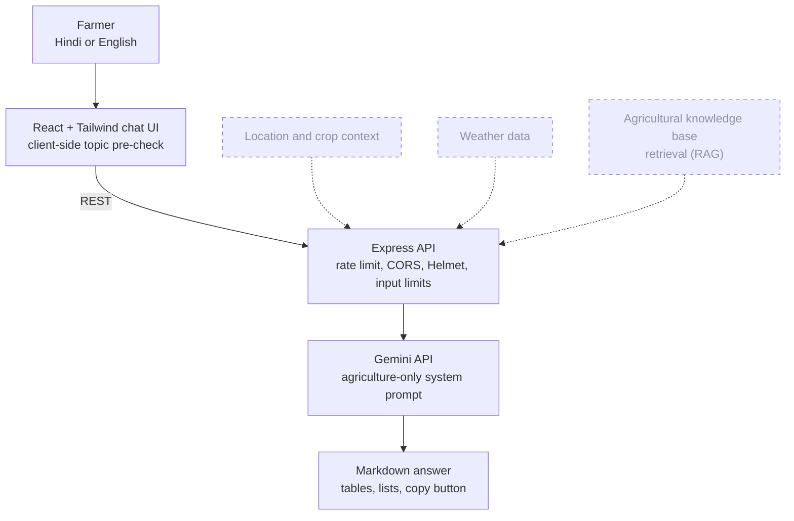
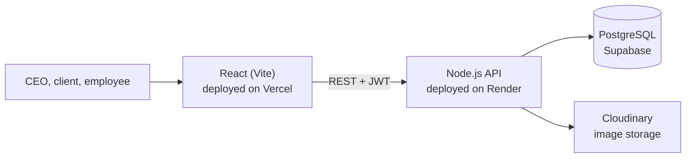
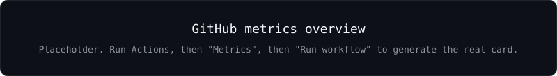
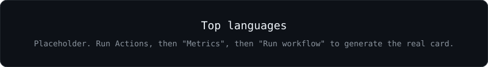
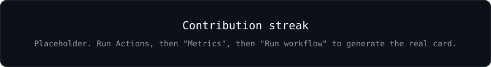
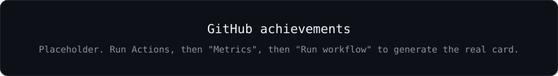
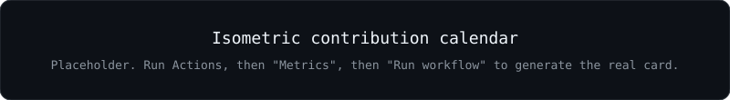
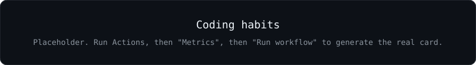
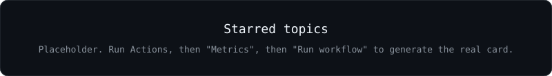

<h1 align="center">
  
</h1>

  <a href="#featured-projects">Projects</a> ·
  <a href="#ai-engineering">AI &amp; Engineering</a> ·
  <a href="#tech-stack">Stack</a> ·
  <a href="#github-stats">Stats</a> ·
  <a href="#open-source">Open Source</a> ·
  <a href="#roadmap">Roadmap</a> ·
  <a href="#contact">Contact</a>

<!-- BEGIN:SOCIAL -->

<!-- END:SOCIAL -->

> **Hi, I'm Kumar Abhinash.**
> I build full-stack web apps and AI-powered tools: a bilingual agriculture assistant, a learning platform for a coaching institute, a business management platform, and an operating-systems simulator.
> I'm growing from student projects into production-minded software engineering, with a focus on the full stack, LLM applications and clean automation.

## 🔭 Current Focus

<!-- BEGIN:FOCUS -->
- 🔭 Evolving AgroMind AI, a bilingual agriculture assistant built on the Gemini API
- 🔭 Full-stack product engineering with React, Node.js and PostgreSQL (Supabase)
- 🔭 Automating my own workflow with GitHub Actions
<!-- END:FOCUS -->

## 🗂️ Featured Projects

<!-- BEGIN:PROJECTS -->
| Project | What it does | Tech | Status | Demo |
|---|---|---|---|---|
| [🌾 AgroMind AI](https://github.com/abhiraj66369-commits/agromind-ai) | Agriculture-only chatbot for farmers, in Hindi and English. Gemini-backed Express API with rate limiting, Helmet and CORS, plus a React chat UI with history and dark/light mode. | React • Tailwind CSS • Node.js • Express • Gemini API | 🚧 In progress | [Live ↗](https://agromind.vercel.app) |
| [🎓 Target Bio Classes](https://github.com/abhiraj66369-commits/TARGETBIO-CLASSES) | EdTech learning platform for a coaching institute: OTP login, student registration, course demos, paid access, teacher dashboard, video/notes/DPP uploads, payment verification and an enquiry panel. | React • Node.js | 🚧 In progress | [Live ↗](https://targetbio-classes.vercel.app) |
| [🏢 Arvika Tech](https://github.com/abhiraj66369-commits/arvika--tech) | Business management platform with CEO, client and employee dashboards: projects, payment proofs, salary records, attendance and messaging. JWT auth on a PostgreSQL (Supabase) backend. | React • Vite • Node.js • PostgreSQL • Supabase • Cloudinary | 🚧 In progress | [Live ↗](https://arvikatech.vercel.app) |
| [🧵 Multi-threaded Simulator](https://github.com/abhiraj66369-commits/multi-threaded-simulator) | Real-time simulator for multithreading models (many-to-one, one-to-one, many-to-many), CPU scheduling and semaphore/monitor synchronization, with thread-state timelines and interactive controls. | HTML | 📄 Report included | — |

More repositories: [WEB-LEARN](https://github.com/abhiraj66369-commits/WEB-LEARN) (learning platform) · [STUDENT-DETAILS](https://github.com/abhiraj66369-commits/STUDENT-DETAILS) (student details devops demo)
<!-- END:PROJECTS -->

### 📈 Repository health

Live numbers pulled from the GitHub API by the [profile-update workflow](.github/workflows/profile-update.yml). Nothing here is typed by hand.

<!-- BEGIN:HEALTH -->
| Repository | ★ Stars | Forks | Open issues + PRs | CI | Latest release | Last push | Main language |
|---|---|---|---|---|---|---|---|
| [agromind-ai](https://github.com/abhiraj66369-commits/agromind-ai) | 0 | 0 | 0 | — | — | 2026-05-10 | JavaScript |
| [TARGETBIO-CLASSES](https://github.com/abhiraj66369-commits/TARGETBIO-CLASSES) | 0 | 0 | 0 | — | — | 2026-02-03 | JavaScript |
| [arvika--tech](https://github.com/abhiraj66369-commits/arvika--tech) | 1 | 0 | 0 | — | — | 2026-08-23 | JavaScript |
| [multi-threaded-simulator](https://github.com/abhiraj66369-commits/multi-threaded-simulator) | 1 | 0 | 0 | — | — | 2025-12-21 | HTML |

Real numbers only; — means not available. Stars across these repositories: 2. Snapshot date: 2026-09-21.
<!-- END:HEALTH -->

<b>🏛️ Architecture: AgroMind AI</b> (solid = built, dashed = planned)

The solid path is what the repository implements today: a React client talking to an Express proxy that keeps the Gemini API key server-side. Location, weather and retrieval are on the [roadmap](#roadmap) and are not implemented yet.

<b>🏛️ Architecture: Arvika Tech</b>

## 🤖 AI &amp; Engineering Focus

| Capability | Status | Where |
|---|---|---|
| LLM API integration (Gemini) behind a server-side proxy | ✅ Built | AgroMind AI |
| System-prompt scoping and topic filtering | ✅ Built | AgroMind AI |
| Bilingual Hindi / English chat UX | ✅ Built | AgroMind AI |
| Retrieval-augmented generation, embeddings, vector search | 🗺️ Planned | AgroMind AI |

**Engineering practices I can point to in real repositories:**

<!-- BEGIN:PRACTICES -->
| Practice | Where it shows up |
|---|---|
| Server-side secrets | AgroMind AI keeps the Gemini API key on the backend and ships a .env.example |
| API hardening | AgroMind AI: rate limiting, Helmet security headers, CORS restricted to the frontend, input sanitization and length limits |
| Authentication and roles | Arvika Tech: JWT auth with CEO / client / employee dashboards |
| Database setup scripts | Arvika Tech: repeatable setup-db script for PostgreSQL tables and constraints |
| Automation | This profile repo: GitHub Actions for snake, metrics, README refresh and quality checks |
<!-- END:PRACTICES -->

## 🧰 Developer Tools

<!-- BEGIN:DEVTOOLS -->
| Tool | What it is |
|---|---|
| [multi-threaded-simulator](https://github.com/abhiraj66369-commits/multi-threaded-simulator) | Interactive teaching tool for operating-system concepts: thread models, CPU scheduling, synchronization. |
| [WEB-LEARN](https://github.com/abhiraj66369-commits/WEB-LEARN) | Learning platform experiments in plain HTML. |
<!-- END:DEVTOOLS -->

## 🌍 Open Source

<!-- BEGIN:OSS -->
**Open Source Journey.** Merged upstream contributions will be listed here, with real PR links only. Until then, my public repositories above are the work to look at.
<!-- END:OSS -->

## 🌐 Portfolio &amp; Resume

Portfolio and resume links appear in the badges at the top of this page as soon as they are added to [`data/profile.json`](data/profile.json). Until then the pinned repositories above are the best view of my work.

## 💻 Tech Stack

Only technologies that appear in my repositories are listed.

<!-- BEGIN:STACK -->
| Area | Technologies |
|---|---|
| **Languages** |  JavaScript · HTML · CSS |
| **Frontend** |  React · Tailwind CSS · Vite |
| **Backend** |  Node.js · Express · REST APIs · JWT auth |
| **Database** |  PostgreSQL · Supabase |
| **AI / LLM** | Gemini API · Prompt design (system prompts) |
| **DevOps** |  Git · GitHub Actions |
| **Cloud / Deployment** |  Vercel · Render · Cloudinary |
| **Tools** |  GitHub · VS Code |
<!-- END:STACK -->

## 📊 GitHub Stats

All cards below are generated by the [Metrics workflow](.github/workflows/metrics.yml) and committed to this repository, so they load fast and never depend on a third-party server being up.

### 🔥 Contribution Streak

### 🏅 DSA &amp; Coding Platforms

<!-- BEGIN:CODING -->
*Add your LeetCode / CodeChef / HackerRank / Codeforces profile links here. Statistics are only shown when they can be fetched reliably.*
<!-- END:CODING -->

### 🏆 Certifications

<!-- BEGIN:CERTS -->
*Add verified certifications here.*
<!-- END:CERTS -->

Certificate files, if any, live in [`certificates/`](certificates/).

### 🎖️ Achievements

<b>📈 Detailed metrics, calendar and habits (click to expand)</b>

### 📅 Isometric Contribution Calendar

### 💡 Coding Habits

### 📌 Starred Topics

### 🐍 Watch the Snake Eat My Contributions

<picture>
  <source media="(prefers-color-scheme: dark)" srcset="https://raw.githubusercontent.com/abhiraj66369-commits/abhiraj66369-commits/output/github-snake-dark.svg">
  
</picture>

## 🌱 Currently Learning

<!-- BEGIN:LEARNING -->
*Add what you are actively learning here (data/profile.json → learning).*
<!-- END:LEARNING -->

## 🗺️ Roadmap

<!-- BEGIN:ROADMAP -->
- [ ] AgroMind AI: ground answers with retrieval over an agricultural knowledge base (RAG) *(planned)*
- [ ] AgroMind AI: location, crop and weather context *(planned)*
- [ ] Screenshots and architecture docs for every flagship repo *(planned)*
- [ ] Automated tests and CI on flagship repos *(planned)*
<!-- END:ROADMAP -->

## 📬 Contact

<!-- BEGIN:CONTACT -->

<!-- END:CONTACT -->

  

